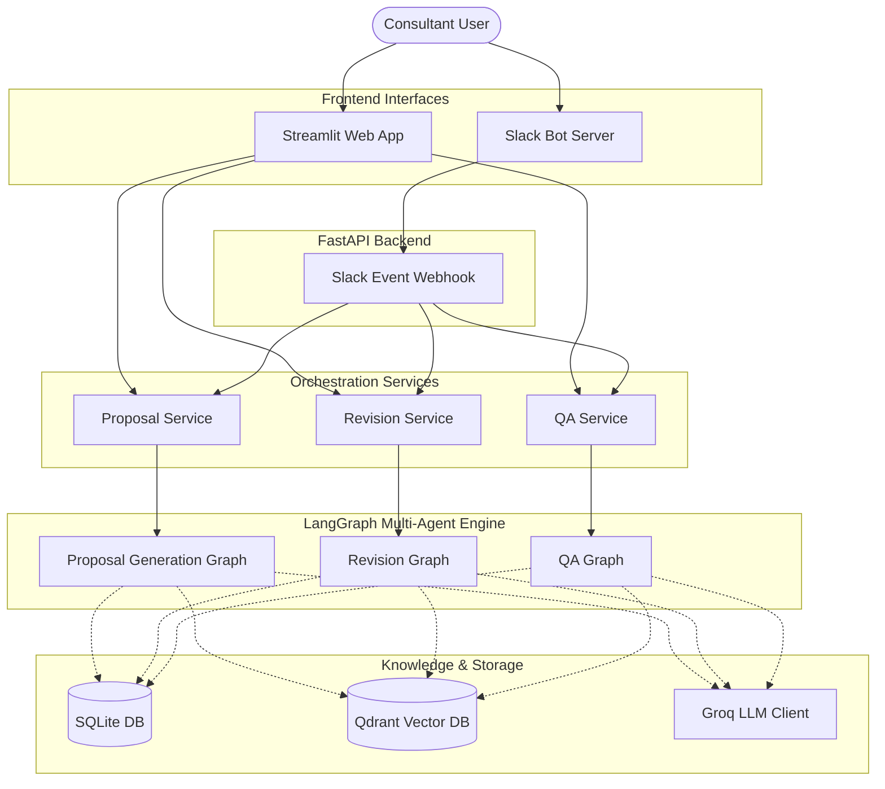
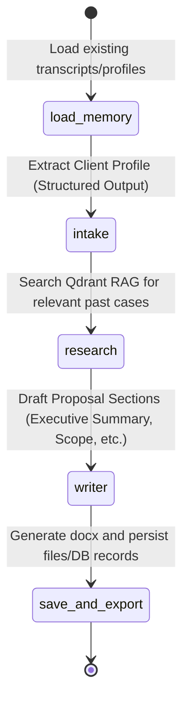
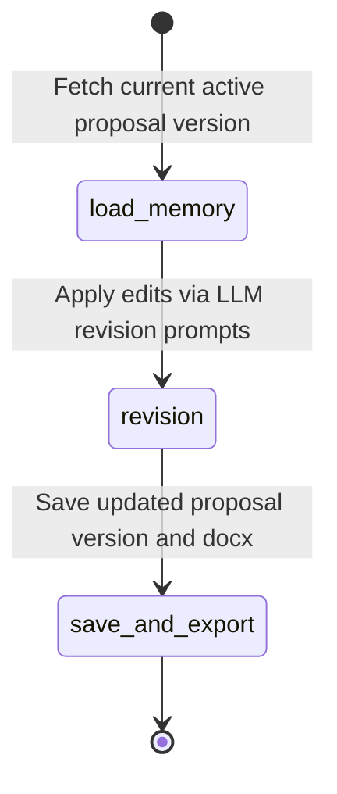
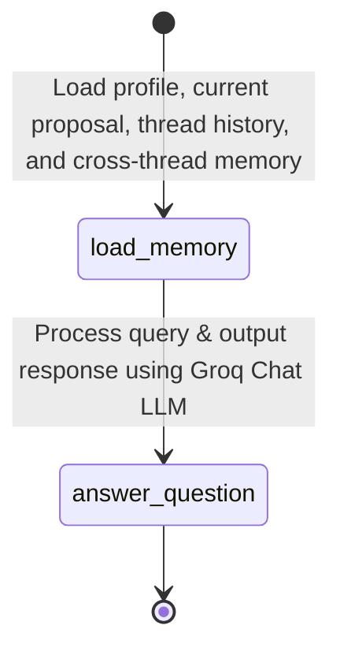
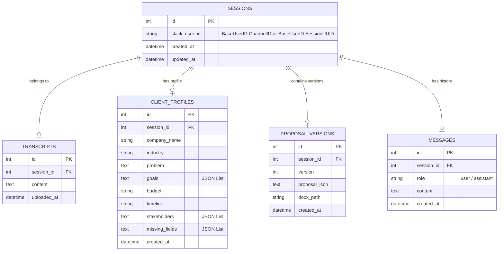

# System Architecture Documentation

This document describes the high-level system architecture, multi-agent workflows, data flow, and database models of the Proposal AI Assistant.

---

## 🏗️ System Overview

The system is designed as a modular, service-oriented architecture using a decoupled frontend/event layer and a shared database backend:

---

## 🤖 LangGraph Multi-Agent Workflows

The core orchestration uses **LangGraph** to model stateful agent pipelines. State is stored in a structured dict representing the proposal progress and conversation memory.

### 1. Proposal Generation Graph (`proposal_graph.py`)
Used when a raw transcript is submitted to draft a new proposal.

### 2. Revision Graph (`revision_graph.py`)
Triggered when the consultant requests tweaks to specific sections of a generated proposal.

### 3. Q&A Graph (`qa_graph.py`)
Handles conversational questions regarding transcripts, profiles, proposals, or previous sessions.

---

## 💾 Data Modeling & Session Persistence

The database stores all history, metadata, and generated files using **SQLite** with **SQLAlchemy ORM**.

---

## 🧠 Memory Systems

### Short-Term Thread Memory
Each session contains its own list of QA questions, answers, and revision requests stored in the `messages` table. When executing any workflow:
- The [load_memory_agent](file:///c:/Users/hp/OneDrive/Desktop/root/proposal-ai-assistant/app/agents/load_memory_agent.py) loads these messages.
- The messages are formatted as a text transcript: `User: ... \n Assistant: ...`.
- This conversation block is passed to the LLM, enabling natural referential follow-up questions.

### Cross-Thread / Session Memory
When a user launches a session, the database key is stored as `base_user_id:session_uuid` (e.g. `consultant_1:f837d-9d7a`). 
- When loading memory, the [load_memory_agent](file:///c:/Users/hp/OneDrive/Desktop/root/proposal-ai-assistant/app/agents/load_memory_agent.py) splits on `:` to resolve the base user `consultant_1`.
- It queries all other active sessions for `consultant_1` and gathers their latest client profiles and proposal contents.
- This cross-thread context is formatted and fed into the QA prompt template, letting the LLM answer queries comparing current and historical proposals.
